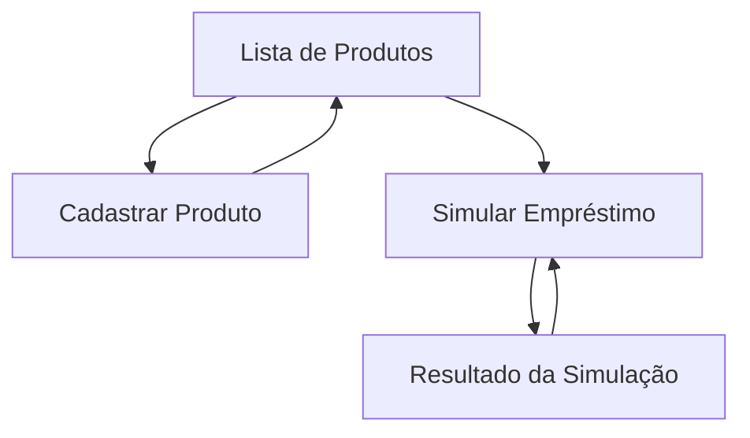

# App de Simulação de Empréstimos - React Native

> **MVP mobile** para cadastrar produtos de empréstimo, listar produtos e simular financiamentos com memória de cálculo mês a mês.

## 📱 Sobre o Projeto

Este aplicativo permite aos usuários criar produtos de empréstimo personalizados e realizar simulações financeiras detalhadas, visualizando:

- **Parcela mensal** calculada pelo sistema Price
- **Total com juros** do financiamento
- **Memória de cálculo** mês a mês (juros, amortização, saldo)
- **Formatação clara** de valores monetários e percentuais

## 🚀 Características Principais

### ✅ Funcionalidades Implementadas

- **Cadastro de Produtos**: Criar produtos com nome, taxa anual e prazo máximo
- **Listagem de Produtos**: Visualizar produtos cadastrados com navegação fluida
- **Simulação Completa**: Cálculos precisos com tabela detalhada mês a mês
- **API Mock Local**: Simulação de endpoints sem dependência externa
- **Validações Robustas**: Mensagens claras e prevenção de erros
- **Acessibilidade**: Labels, foco e áreas de toque adequadas

### 🎯 Stack Tecnológica

- **React Native 0.72.10** - Framework mobile multiplataforma
- **TypeScript 4.8.4** - Type safety e melhor DX
- **React Navigation** - Navegação entre telas
- **React Hook Form** - Gerenciamento de formulários
- **AsyncStorage** - Persistência local de dados
- **Jest + Testing Library** - Testes unitários e integração
- **ESLint + Prettier** - Qualidade e formatação de código

## 📋 Pré-requisitos

- **Node.js**: 18.18.2 ou superior
- **npm**: 9.8.1 ou superior
- **React Native CLI**: Instalado globalmente
- **Android Studio** (para Android) ou **Xcode** (para iOS)

## 🛠️ Instalação e Execução

### 1. Clone o repositório
```bash
git clone <url-do-repositorio>
cd app-simulacao-emprestimos
```

### 2. Instale as dependências
```bash
npm install
```

### 3. Execute no dispositivo/emulador

#### Android
```bash
# Inicie o Metro bundler
npm start

# Em outro terminal, execute no Android
npm run android
```

#### iOS (apenas macOS)
```bash
# Instale pods do iOS
cd ios && pod install && cd ..

# Execute no iOS
npm run ios
```

## 🧪 Testes

### Executar todos os testes
```bash
npm test
```

### Executar com cobertura
```bash
npm run test:coverage
```

### Verificação de tipos
```bash
npm run type-check
```

### Lint do código
```bash
npm run lint
```

**Meta de Cobertura**: ≥ 80% (especialmente no domínio de cálculos)

## 📊 Fórmulas e Cálculos

### Taxa Efetiva Mensal
```typescript
const taxaMensalEfetiva = Math.pow(1 + (taxaAnual / 100), 1/12) - 1;
```

### Parcela Mensal (Sistema Price)
```typescript
// Se taxa = 0, parcela = valor / meses
// Senão: PMT = P * [i * (1+i)^n] / [(1+i)^n - 1]
const pmt = valor * (taxaMensal * Math.pow(1 + taxaMensal, meses)) / 
            (Math.pow(1 + taxaMensal, meses) - 1);
```

### Memória de Cálculo
Para cada mês:
```typescript
const juros = saldoDevedor * taxaMensal;
const amortizacao = parcela - juros;
const novoSaldo = saldoDevedor - amortizacao;
```

## 🏗️ Arquitetura

```
src/
├── components/          # Componentes reutilizáveis
│   ├── forms/          # Componentes de formulário
│   ├── cards/          # Cards de produto e resumo
│   └── tables/         # Tabela de memória
├── screens/            # Telas principais
│   ├── ProductList/    # Listagem de produtos
│   ├── ProductForm/    # Cadastro de produto
│   └── Simulation/     # Simulação de empréstimo
├── services/           # API mock e storage
│   ├── api/           # Contratos de API
│   └── storage/       # AsyncStorage wrapper
├── domain/             # Regras de negócio
│   ├── calculations/   # Cálculos financeiros
│   └── validations/   # Validações de dados
├── hooks/              # Custom hooks
├── types/              # Definições TypeScript
└── utils/              # Utilitários e formatação
```

## 📱 Fluxo de Navegação



## 🎨 Design System

### Cores Principais
```typescript
export const colors = {
  primary: '#0066CC',      // Azul Caixa
  secondary: '#FFB800',    // Amarelo Caixa
  success: '#28A745',      // Verde sucesso
  error: '#DC3545',        // Vermelho erro
  text: '#333333',         // Texto principal
  textLight: '#666666',    // Texto secundário
  background: '#F8F9FA',   // Fundo claro
  white: '#FFFFFF',        // Branco
};
```

### Tipografia
- **Títulos**: 18-24px, weight 600
- **Subtítulos**: 16px, weight 500  
- **Corpo**: 14px, weight 400
- **Labels**: 12px, weight 500

## 📋 Validações e Regras

### Produto
| Campo | Regra | Mensagem |
|-------|-------|----------|
| Nome | 3-60 chars, único | "Nome obrigatório" / "Já existe" |
| Taxa Anual | 0-400%, 2 casas | "Taxa anual inválida" |
| Prazo Máximo | 1-1200 meses | "Prazo máximo inválido" |

### Simulação
| Campo | Regra | Mensagem |
|-------|-------|----------|
| Produto | Obrigatório | "Selecione um produto" |
| Valor | R$ 100 - R$ 10.000.000 | "Valor inválido" |
| Meses | 1 até prazo máximo | "Prazo inválido para este produto" |

## 🔧 Configuração de Desenvolvimento

### Variáveis de Ambiente
```bash
# .env
API_BASE_URL=http://localhost:3000  # Para testes com API real
ENABLE_FLIPPER=true                 # Debug no Flipper
```

### Scripts Disponíveis
```json
{
  "start": "react-native start",
  "android": "react-native run-android", 
  "ios": "react-native run-ios",
  "test": "jest",
  "test:coverage": "jest --coverage",
  "test:watch": "jest --watch",
  "type-check": "tsc --noEmit",
  "lint": "eslint . --ext .js,.jsx,.ts,.tsx",
  "lint:fix": "eslint . --ext .js,.jsx,.ts,.tsx --fix"
}
```

## 📚 API Contracts (Mock)

### Endpoints Simulados

#### `POST /produtos`
```typescript
// Request
{
  "nome": "Empréstimo Pessoal",
  "taxaAnual": 18.0,
  "prazoMaxMeses": 60
}

// Response 201
{
  "id": "uuid",
  "nome": "Empréstimo Pessoal", 
  "taxaAnual": 18.0,
  "prazoMaxMeses": 60
}
```

#### `GET /produtos`
```typescript
// Response 200
[
  {
    "id": "uuid",
    "nome": "Empréstimo Pessoal",
    "taxaAnual": 18.0,
    "prazoMaxMeses": 60
  }
]
```

#### `POST /simulacoes`
```typescript
// Request
{
  "produtoId": "uuid",
  "valor": 10000.00,
  "meses": 12
}

// Response 200
{
  "produto": { /* dados do produto */ },
  "taxaMensalEfetiva": 1.3906,
  "parcelaMensal": 931.50,
  "totalComJuros": 11178.00,
  "memoria": [
    {
      "mes": 1,
      "juros": 139.06,
      "amortizacao": 792.44,
      "saldo": 9207.56
    }
    // ... demais meses
  ]
}
```

## 🐛 Troubleshooting

### Problemas Comuns

#### Metro bundler não inicia
```bash
npx react-native start --reset-cache
```

#### Erro de build Android
```bash
cd android && ./gradlew clean && cd ..
npx react-native run-android
```

#### Erro de build iOS
```bash
cd ios && rm -rf Pods && pod install && cd ..
npx react-native run-ios
```

#### Testes falhando
```bash
npm test -- --clearCache
npm test
```

## 📈 Métricas de Qualidade

### Cobertura de Testes
- **Meta**: ≥ 80%
- **Foco**: Cálculos financeiros, validações, fluxos críticos

### Performance
- **Simulação**: < 300ms (mock)
- **Navegação**: Transições fluidas
- **Bundle**: Otimizado para produção

### Acessibilidade
- **Labels**: Todos os inputs possuem accessibilityLabel
- **Foco**: Navegação via teclado funcional
- **Contraste**: Mínimo WCAG AA
- **Toque**: Áreas ≥ 44x44px

## 🚀 Deploy e Distribuição

### Build de Produção

#### Android (APK)
```bash
cd android
./gradlew assembleRelease
```

#### iOS (Archive)
```bash
npx react-native run-ios --configuration Release
```

### Checklist de Release
- [ ] Testes passando (≥ 80% cobertura)
- [ ] Lint sem erros
- [ ] Type-check sem erros
- [ ] Build de produção funcionando
- [ ] Teste em dispositivos físicos
- [ ] Validação de acessibilidade

## 👥 Contribuição

### Padrões de Código
1. **TypeScript**: Usar tipagem estrita
2. **Nomenclatura**: camelCase para variáveis, PascalCase para componentes
3. **Imports**: Organizados (externos → internos → relativos)
4. **Testes**: Nomear com `.test.ts` ou `.spec.ts`

### Pull Request
1. Branch a partir de `main`
2. Implementar feature/fix
3. Adicionar/atualizar testes
4. Verificar lint e type-check
5. Documentar mudanças no PR

## 📄 Licença

Este projeto é um MVP para avaliação técnica.

## 📞 Suporte

Para questões técnicas ou dúvidas sobre implementação, consulte:

- **Documentação React Native**: https://reactnative.dev
- **Cálculos Financeiros**: Fórmulas implementadas seguem padrão Price
- **Testes**: Jest + React Native Testing Library

---

**Versão**: 1.0.0  
**Última atualização**: Agosto 2025  
**Compatibilidade**: React Native 0.72.10
