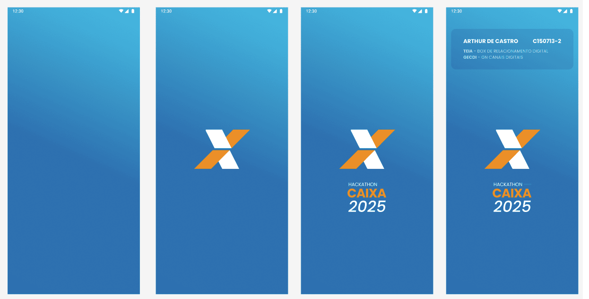
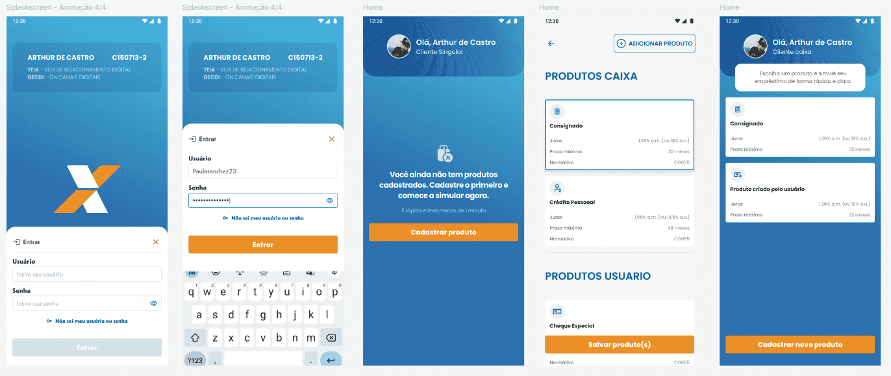

# C150713 — Sistema de Produtos Financeiros CAIXA

> App **React Native + Expo** para **simulação** e **cadastro** de produtos financeiros, com foco em **empréstimos consignados** (PRICE/SAC), UX consistente e **Design System** próprio.

## Protótipo implementado
Algumas modificações em tempo de desenvolvimento foram adaptadas mediante necessidade de usabilidade.




## 📦 Stack & Compatibilidade

- **Expo:** `53.0.20`  
- **React Native:** `0.79.5` (Hermes)  
- **React / DOM:** `19.0.0 / 19.0.0`  
- **TypeScript:** `5.8.3`  
- **Jest / jest-expo:** `29.7.0 / 53.0.9`  
- **React Navigation:** `7.x`  
- **Async Storage:** `@react-native-async-storage/async-storage`  
- **Safe Area / Screens:** `react-native-safe-area-context` / `react-native-screens`


## ▶️ Como Rodar (Android)

### Pré-requisitos
- **Node 18+**
- **Android Studio** instalado e **aberto**
- **Expo CLI** (via `npx expo …` já resolve)

### Checklist Android/ADB
1. Abra o **Android Studio** → **Device Manager** e garanta que há **um emulador instalado** (ex.: `Medium_Phone_API_36.0`) **e iniciado**.  
2. Confirme no terminal:
   ```bash
   adb devices
   ```
   Deve listar pelo menos **1 device** em `device`.

### Instalação & Execução
```bash
npm install
npm run android
```

> O Expo fará o **prebuild** e abrirá o emulador se necessário. 

> - **buildTools:** 35.0.0  
> - **minSdk/compileSdk/targetSdk:** 24 / 35 / 35  
> - **NDK:** 27.1.12297006  
> - **Kotlin:** 2.0.21 (KSP 2.0.21-1.0.28)


---

## 🧪 Testes & Qualidade

**Scripts**
```bash
npm test                 # Jest
npm run test:watch       # Watch
npm run test:coverage    # Cobertura
npm run type-check       # TS sem emitir
npm run lint             # ESLint
npm run format           # Prettier
```

**Cobertura (último relatório)**
- **Statements:** 80.64% (1104/1369)  

**Atalho (grep de statements)**
```bash
npm test -- --coverage --watchAll=false --silent | grep "Statements"
```

---

## 🚀 Funcionalidades

- **Simulação dinâmica** (PRICE/SAC) com validações  
- **Cadastro de produtos** por categoria/convênio  
- **Validação automática de taxas**  
- **Design System** (tokens, componentes, ícones)  
- **Persistência local** (Async Storage)  
- **Navegação nativa** (stack) + Safe Area/Screens

### Produtos Consignados (exemplos)
- **INSS:** 1,56% a.m.  
- **Militar:** 1,56% a.m.  
- **FUNCEF:** 1,55% a.m.  
- **TJDFT:** 1,55% a.m.

> ℹ️ Ao exibir taxa anual, deixar claro que é **taxa efetiva anual** derivada da mensal.

---

## 🗂️ Estrutura do Projeto

```
.
├── src/
│   ├── contexts/               # Context API (estado global)
│   ├── design-system/          # DS: tokens, componentes, ícones
│   │   ├── components/         # Botões, inputs, tipografia, etc.
│   │   ├── icons/
│   │   └── tokens/             # Cores, espaçamentos, radius, sombra
│   ├── modules/                # Co-location por domínio
│   │   ├── home/
│   │   ├── products/
│   │   │   └── screens/
│   │   │       ├── CreateProduct/
│   │   │       ├── EnhancedCreateProduct/
│   │   │       ├── LoanConfiguration/
│   │   │       └── SimulationResult/
│   │   ├── simulationLoading/  # Loading/feedback de simulação
│   │   └── splash/
│   ├── navigation/             # Stack/Navigator
│   ├── services/               # Regras & integrações
│   │   ├── products/           # Serviços de produtos
│   │   └── simulations/        # Cálculos financeiros (PRICE/SAC)
│   ├── types/                  # Tipos/contratos TS
│   └── utils/                  # Helpers puros
├── data/
│   ├── consignado/
│   │   ├── inss.json
│   │   └── convenios/
│   ├── habitacao/
│   └── outro/
├── assets/                     # Imagens, Lottie, SVGs
├── coverage/                   # Relatórios Jest
└── android/                    # (bare Android gerado pelo Expo)
```

---

## 🏗️ Arquitetura & Padrões

- **Co-located pattern** (features por domínio em `src/modules`)  
- **Design System** (tokens + componentes reutilizáveis; evitar hard-CSS)  
- **Context API** + **custom hooks** para lógica de UI  
- **Service Layer** desacoplando UI das regras/calculadora  
- **100% TypeScript** (tipos, DTOs, contratos)

**Modelo de Produto (exemplo)**
```json
{
  "id": "consignado_convenio_militar",
  "categoria": "CONSIGNADO",
  "subtipo": "CONVENIO",
  "nome_exibicao": "Militar – Consignado",
  "status_contratacao": "ATIVO",
  "prazo": { "minimoMeses": 1, "maximoMeses": 96 },
  "taxa_am": 1.56,
  "margem_consignavel_max": 30
}
```

---

## 🎨 Diretrizes de UI

- Tipografia consistente (regular/semibold)  
- Espaçamentos proporcionais (sem sobra no topo)  
- Cards centrados, radius generoso (suavidade)  
- Imagens no README: `` ou ``  
- **Peso de imagem**: priorize **≤ 40 KB** (WebP/JPEG otimizados)

---

## 📄 Licença & Contatos

Projeto público — **Arthur de Castro**  
GitHub: <https://github.com/arthurfjadecastro/HACKAIXA2025>

**Versão:** `1.0.0`  
**Última atualização:** **Agosto/2025**
